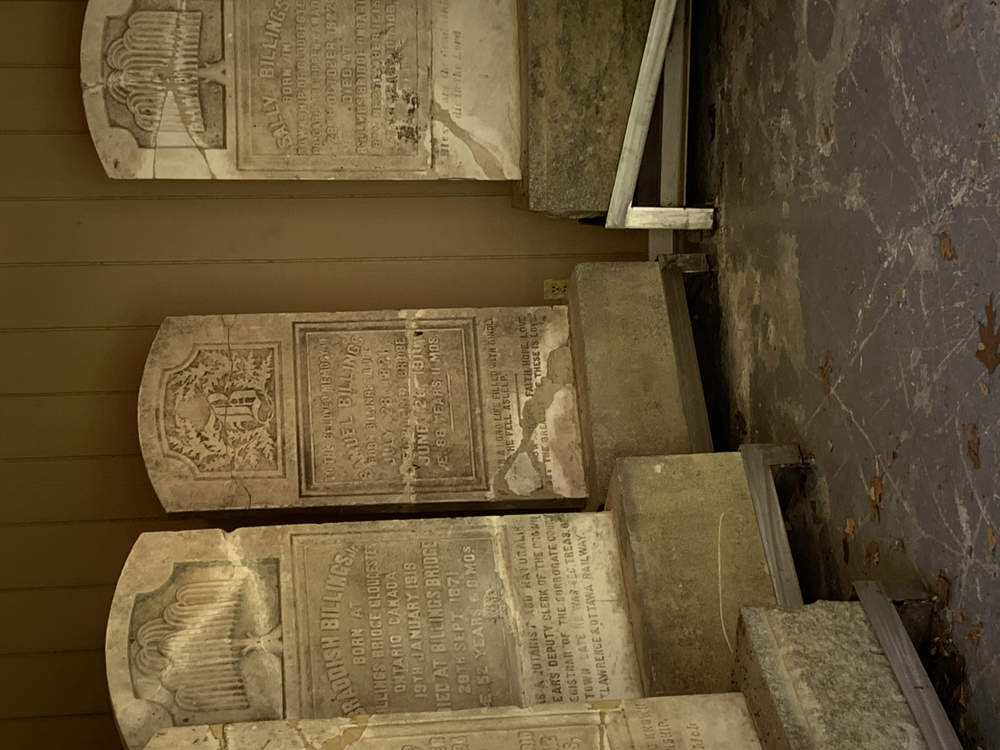

## Graveyard Research on the Billings Estate Cemetery
By analyzing and comparing the graves of the Billings family to a British scheme we were able to see the similarites and differences in the graves of European settlers as opposed to those living in Europe at the same time.

Many of the graves within the cemetery are not actual descendants of the Billings family, and instead extended family or friends of the family. 

The Headstones of the Billings family were stored inside due to weather damage and vandalism. These stones share many similarites with other stones of the same religious affiliation under the British graveyard scheme. 

By looking at the graves of the Billings family we can learn further about the wealth and influence Bradish Billings had in the area.

While analzying the size and styles of these graves and comparing them to the styles of the British scheme, it is somewhat problematic. By using a graveyard scheme from Britian, in a Canadian context, we are ignoring the many different non-European styles of graves and graveyards that are heavilly represented in Canada. Specifically that of the many Indigenious Nations who have lived and still live in Canada. The land that Billings Bridge is built on, was orginally inhabited by Iroquois and Mississauga people was sold to British settlers in the late 18th Century. By relying on European styles, we are excluding the different burial styles and practices of the Indigenious peoples who were here long before the British colonizers. 

